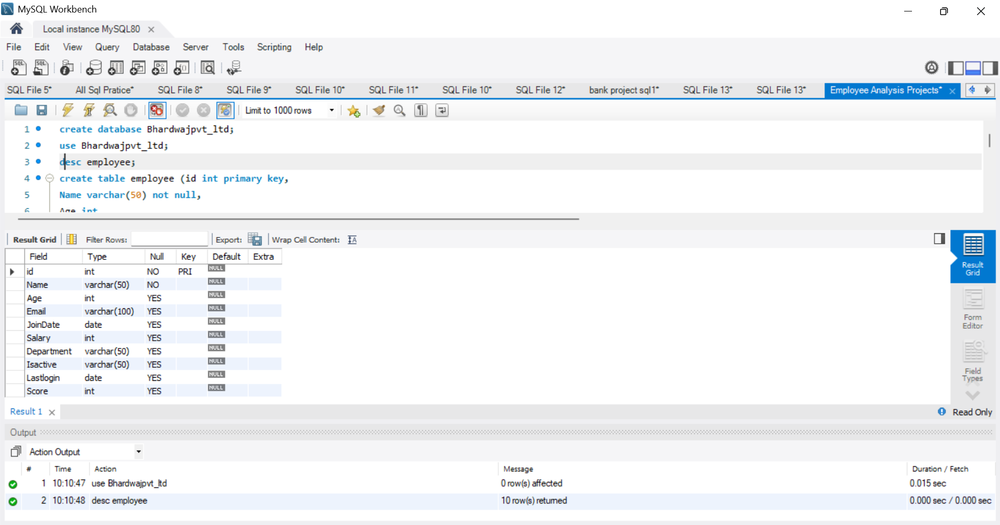
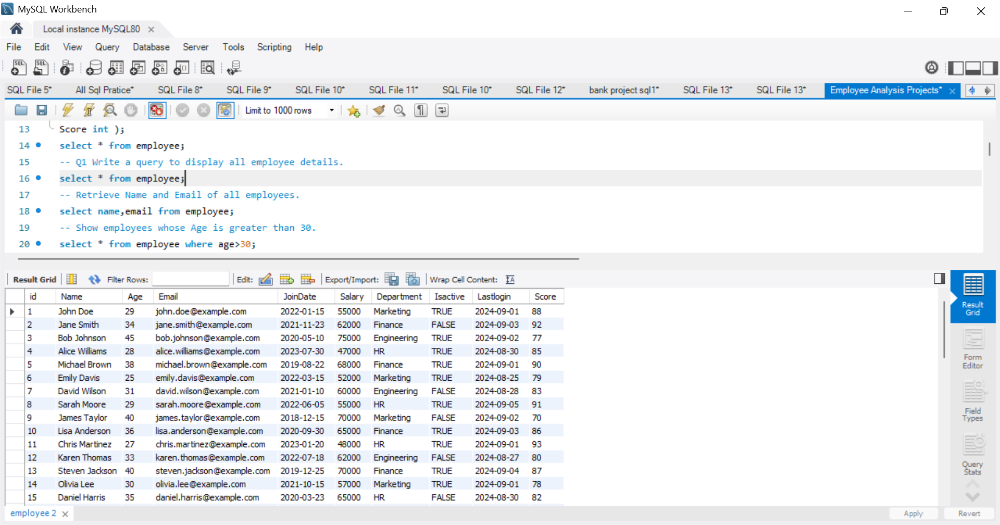
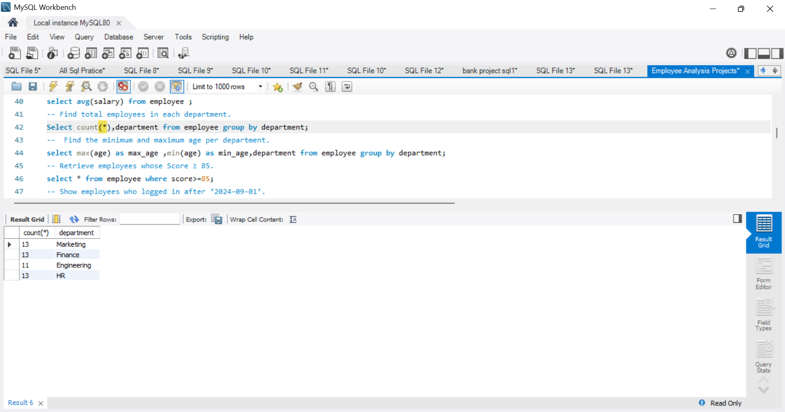
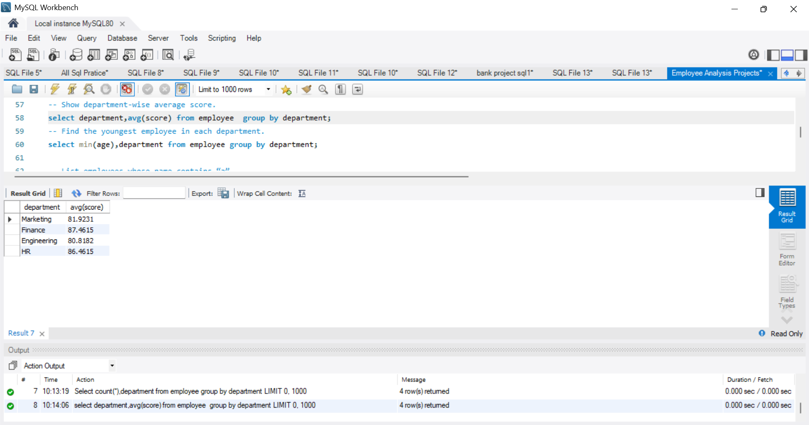
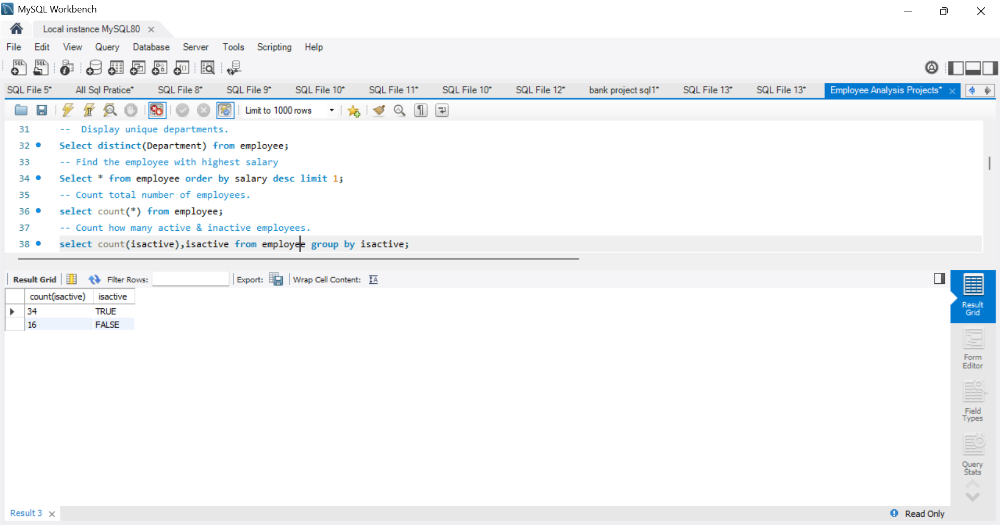
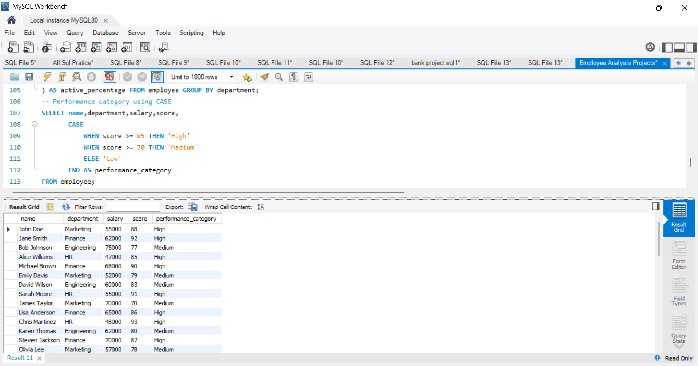
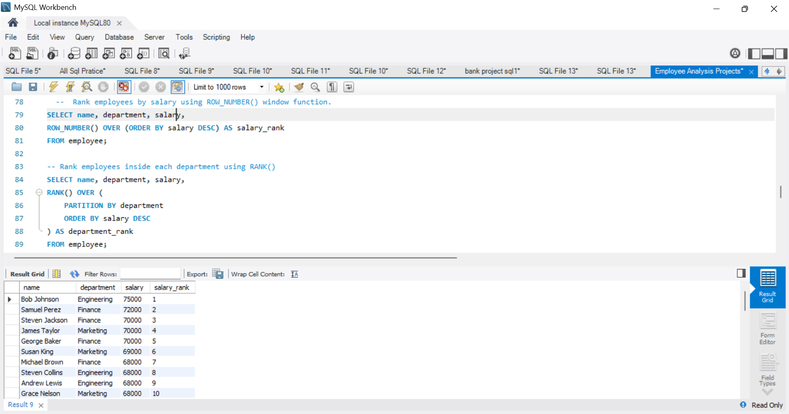
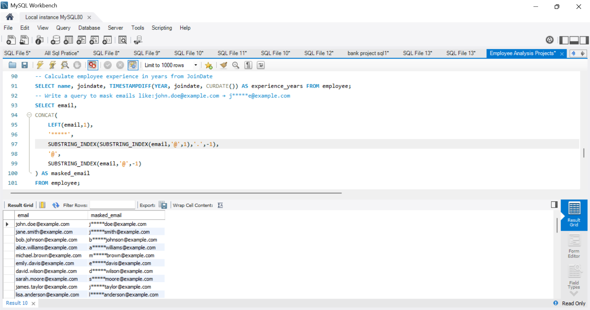

# 🚀 Employee Analysis SQL Project

## 📖 Project Overview

The Employee Analysis SQL Project is a data analytics project developed using MySQL to analyze employee information and generate meaningful business insights. The project focuses on employee performance, salary analysis, workforce distribution, department-wise reporting, and data security using SQL queries.

This project demonstrates practical SQL skills commonly required for Data Analyst, MIS Analyst, Business Analyst, and SQL Developer roles.

---

## 📌 Project Type

**Data Analysis Project | SQL Project | Portfolio Project**

---

## ⭐ Key Highlights

* Designed and implemented an Employee Database using MySQL.
* Developed 30+ SQL queries for employee analysis and reporting.
* Applied Aggregate Functions, CASE Statements, and Window Functions.
* Performed department-wise workforce and salary analysis.
* Implemented email masking using SQL string functions.
* Generated business insights through analytical SQL queries.
* Utilized ranking and performance categorization techniques.

---

## 🎯 Project Objectives

* Create and manage an Employee Database.
* Analyze employee performance and salary trends.
* Perform department-wise workforce analysis.
* Track active and inactive employees.
* Implement advanced SQL concepts for business reporting.
* Generate actionable insights from employee data.

---

## 🛠️ Tools & Technologies Used

* MySQL
* MySQL Workbench
* SQL

---

## 🗄️ Database Schema

### Database Name

```sql
Bhardwajpvt_ltd
```

### Table Name

```sql
employee
```

### Columns

| Column     | Data Type    |
| ---------- | ------------ |
| id         | INT          |
| Name       | VARCHAR(50)  |
| Age        | INT          |
| Email      | VARCHAR(100) |
| JoinDate   | DATE         |
| Salary     | INT          |
| Department | VARCHAR(50)  |
| IsActive   | VARCHAR(50)  |
| LastLogin  | DATE         |
| Score      | INT          |

---

## 📊 SQL Concepts Used

### Basic SQL

* SELECT
* WHERE
* ORDER BY
* DISTINCT
* LIMIT

### Aggregate Functions

* COUNT()
* AVG()
* MIN()
* MAX()

### Grouping & Filtering

* GROUP BY
* HAVING

### Date Functions

* CURDATE()
* TIMESTAMPDIFF()

### Advanced SQL

* CASE Statement
* Window Functions
* ROW_NUMBER()
* RANK()

### String Functions

* CONCAT()
* LEFT()
* SUBSTRING_INDEX()

---

## 📈 Business Questions Solved

### Employee Analysis

* Display all employee records.
* Retrieve employee names and email addresses.
* Find employees older than 30 years.
* Identify high-performing employees.

### Department Analysis

* Count employees in each department.
* Calculate department-wise average scores.
* Find minimum and maximum employee age by department.

### Salary Analysis

* Identify highest-paid employees.
* Rank employees by salary.
* Rank employees within departments.

### Workforce Analysis

* Count active and inactive employees.
* Calculate employee experience from joining date.
* Categorize employees based on performance score.

### Data Security

* Mask employee email addresses using SQL string functions.

---

## 📸 Project Screenshots

### Database Creation



### Employee Data



### Department-wise Employee Count



### Department-wise Average Score



### Active vs Inactive Employees



### Performance Category Using CASE Statement



### Salary Ranking Using Window Function



### Email Masking Using String Functions



---

## 💡 Skills Demonstrated

* Database Design
* SQL Query Writing
* Data Analysis
* Business Reporting
* Data Aggregation
* Window Functions
* CASE Statements
* String Functions
* Data Security Techniques
* Workforce Analytics

---

## 📂 Repository Structure

```text
Employee-Analysis-SQL-Project/
│
├── Employee Analysis Projects.sql
├── README.md
│
└── Screenshots_project/
    ├── Database_Creation.png
    ├── Department_Analysis.png
    ├── Department_Avg_score.png
    ├── Employee_Attrition.png
    ├── Employee_Data.png
    ├── Employee_score_case_function.png
    ├── Salary_rank_function.png
    └── Substring_email.png
```

---

## 🚀 Project Outcome

Successfully designed and implemented an Employee Analysis Database using MySQL. Developed analytical SQL queries to evaluate employee performance, salary trends, department-level metrics, workforce distribution, and data privacy techniques. This project demonstrates practical SQL and business analysis skills applicable to Data Analyst, MIS Analyst, and SQL Developer roles.

---

## 👩‍💻 Author

**Deepali Sharma**

Aspiring Data Analyst | MIS Analyst | SQL Enthusiast

### Connect With Me

* LinkedIn: https://www.linkedin.com/in/deepali-sharma-689731340/
* GitHub: https://github.com/sharmadeepali413-cpu

---

⭐ If you found this project useful, consider giving it a star on GitHub.
